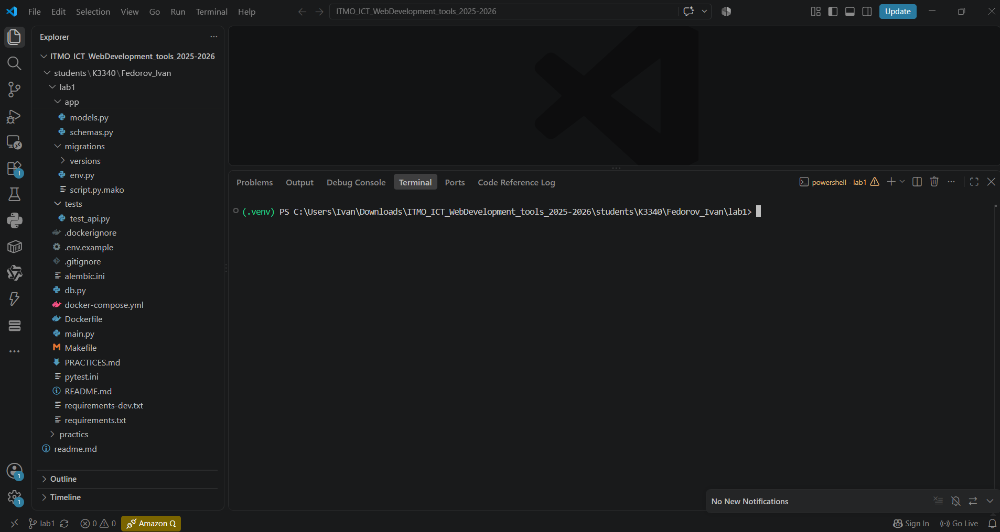
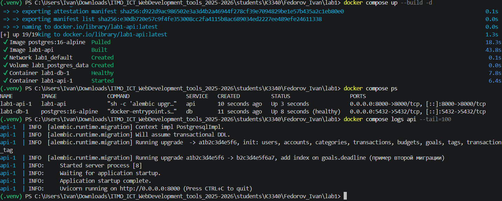
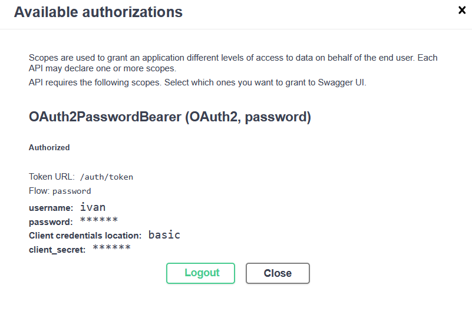
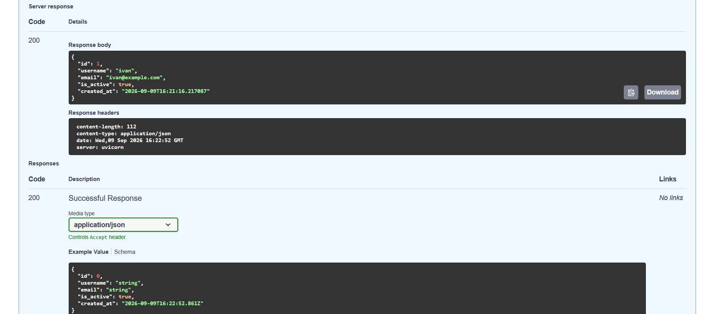
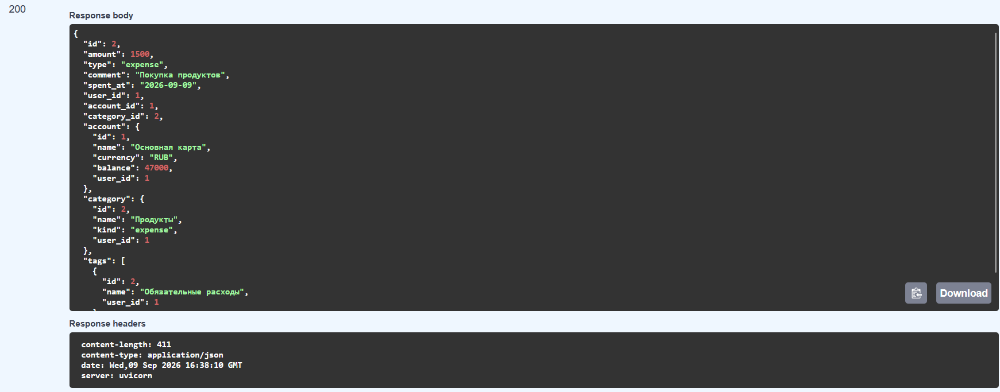
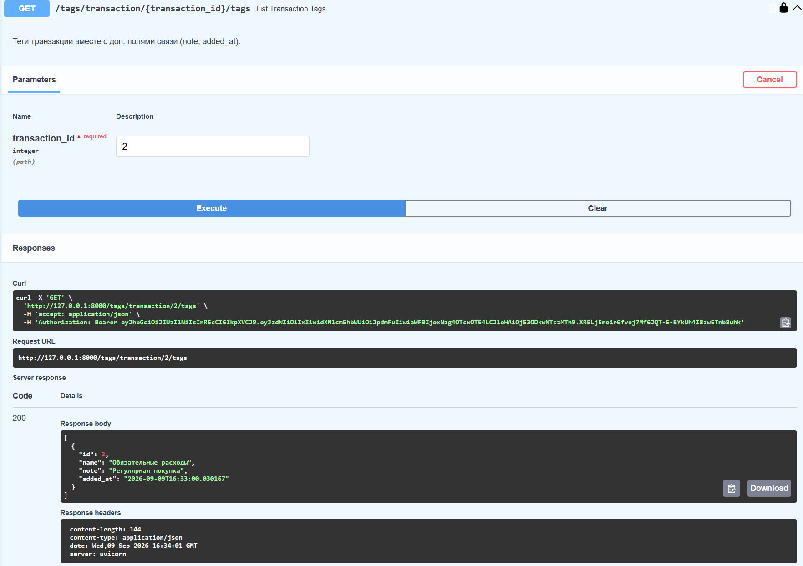
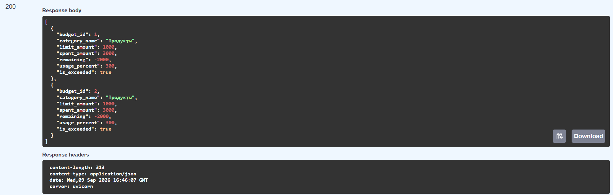
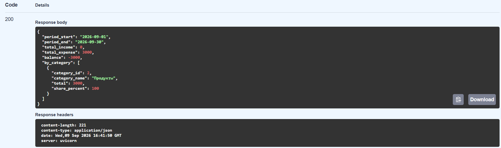

# Лабораторная работа 1

## Сервис управления личными финансами

Серверное приложение реализовано на **FastAPI**, **SQLModel**, **PostgreSQL**, **Alembic** и **JWT**.

## Реализовано

- регистрация и JWT-аутентификация пользователей;
- CRUD для счетов, категорий, транзакций, бюджетов, целей и тегов;
- связи `one-to-many` и `many-to-many`;
- ассоциативная таблица `transaction_tag` с дополнительными полями;
- автоматический пересчёт баланса;
- контроль превышения бюджета;
- отчёт по доходам и расходам за период;
- миграции Alembic;
- запуск через Docker Compose;
- интеграционные API-тесты.

## Структура проекта



## Запуск через Docker

```bash
docker compose up --build
```

После запуска:

- Swagger UI: `http://127.0.0.1:8000/docs`;
- health-check: `http://127.0.0.1:8000/health`.

## Демонстрация API

### Docker Compose


### Миграции Alembic



### Авторизация



### Текущий пользователь



### Вложенная транзакция



### Связь транзакции и тега



### Состояние бюджета



### Отчёт за период



## Вывод

В результате создан полноценный backend-сервис с базой данных, авторизацией, бизнес-правилами, миграциями, тестами и Docker-развёртыванием.
