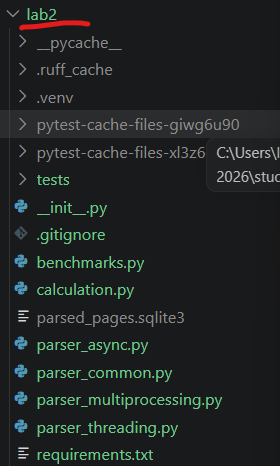
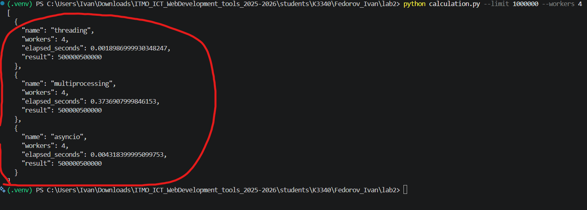
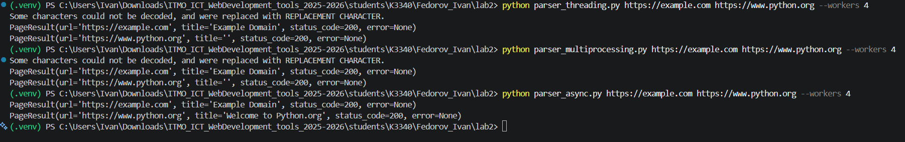
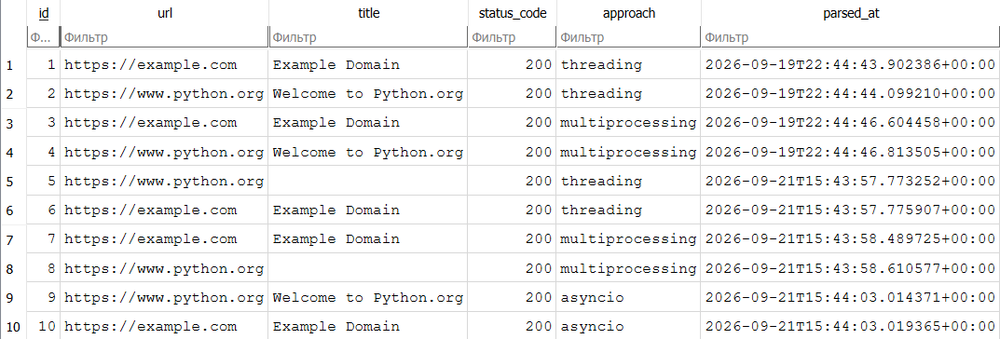
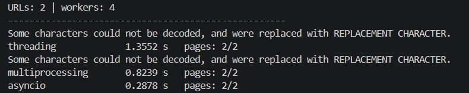

# Лабораторная работа 2

## Потоки, процессы и асинхронность

## Цель работы

Изучить различия между потоками, процессами и асинхронным выполнением в Python, а также сравнить их применение для вычислительных и сетевых задач.

## Постановка задачи

В работе требовалось:

- реализовать вычисление суммы чисел от `1` до `10 000 000 000 000`;
- использовать три подхода: `threading`, `multiprocessing` и `asyncio`;
- разделить вычисление на несколько подзадач;
- измерить время выполнения;
- реализовать параллельный парсинг нескольких веб-страниц;
- извлечь заголовок страницы из HTML;
- сохранить результаты парсинга в базу данных;
- сравнить особенности и производительность подходов.

## Используемые технологии

- Python 3;
- `ThreadPoolExecutor` для потоков;
- `ProcessPoolExecutor` для процессов;
- `asyncio` и `async/await` для асинхронного выполнения;
- `aiohttp` для асинхронных HTTP-запросов;
- `BeautifulSoup` для разбора HTML;
- SQLite для хранения результатов парсинга.

## Структура проекта

```text
lab2/
├── calculation.py
├── benchmarks.py
├── parser_common.py
├── parser_threading.py
├── parser_multiprocessing.py
├── parser_async.py
├── requirements.txt
├── tests/
│   └── test_lab2.py
└── README.md
```



## Задача 1. Вычисление суммы

Функция `calculate_sum()` вычисляет сумму чисел на заданном интервале.

Чтобы выполнить задачу параллельно, диапазон `1..N` разбивается на несколько частей. Каждая часть передаётся отдельной задаче, после чего частичные суммы складываются.

Ожидаемый результат проверяется по формуле:

```text
1 + 2 + ... + N = N * (N + 1) / 2
```

### Реализация через потоки

Файл `calculation.py` использует `ThreadPoolExecutor`. Потоки выполняют расчёт отдельных интервалов и возвращают частичные суммы.

Потоки удобны для операций, связанных с ожиданием ввода-вывода, но CPU-вычисления в CPython ограничиваются GIL.

### Реализация через процессы

Для процессов используется `ProcessPoolExecutor`. Каждая задача выполняется в отдельном процессе Python со своей памятью.

Процессы позволяют эффективнее использовать несколько ядер CPU, но требуют больше ресурсов на создание и обмен данными.

### Реализация через asyncio

Асинхронная версия создаёт задачи через `asyncio.gather()` и использует `async/await`.

Асинхронность не создаёт дополнительные процессы и потоки. Она позволяет переключаться между задачами в моменты ожидания.



## Задача 2. Параллельный парсинг страниц

Для каждой URL-страницы реализована функция `parse_and_save()`.

Алгоритм работы:

1. отправить HTTP-запрос по URL;
2. получить HTML-код страницы;
3. найти тег `<title>`;
4. сохранить URL, заголовок и HTTP-статус в SQLite;
5. вывести результат выполнения.

Общая логика работы с базой и HTML находится в `parser_common.py`.

### Парсинг через threading

Файл `parser_threading.py` запускает несколько сетевых запросов в `ThreadPoolExecutor`.

Этот вариант подходит для сетевых задач, потому что во время ожидания ответа одного сайта поток может заниматься другой задачей.

### Парсинг через multiprocessing

Файл `parser_multiprocessing.py` запускает обработку URL в отдельных процессах через `ProcessPoolExecutor`.

Процессы изолированы друг от друга. Такой подход имеет большие накладные расходы, но не зависит от GIL.

### Парсинг через asyncio

Файл `parser_async.py` использует `aiohttp`, `async/await` и `asyncio.gather()`.

Несколько HTTP-запросов выполняются конкурентно в одном event loop, поэтому этот вариант хорошо подходит для большого количества сетевых операций.



## Сохранение результатов

Результаты сохраняются в SQLite-базу `parsed_pages.sqlite3`.

Основные поля таблицы:

| Поле | Назначение |
| --- | --- |
| `url` | адрес обработанной страницы |
| `title` | заголовок страницы из HTML |
| `status_code` | HTTP-статус ответа |
| `approach` | использованный подход |
| `parsed_at` | время сохранения результата |



## Запуск проекта

Установить зависимости:

```powershell
python -m venv .venv
.venv\Scripts\Activate.ps1
pip install -r requirements.txt
```

Запустить сравнение вычислений:

```powershell
python calculation.py --limit 10000000000000 --workers 4
```

Для быстрой проверки:

```powershell
python calculation.py --limit 1000000 --workers 4
```

Запустить парсинг:

```powershell
python parser_threading.py https://example.com https://www.python.org --workers 4
python parser_multiprocessing.py https://example.com https://www.python.org --workers 4
python parser_async.py https://example.com https://www.python.org --workers 4
```

Для автоматического замера времени всех трёх вариантов используются одинаковые URL:

```powershell
python benchmark_parsing.py https://example.com https://www.python.org --workers 4
```

Скрипт выведет готовые значения времени для строк `threading`, `multiprocessing` и `asyncio`. Их нужно перенести в таблицу сравнения ниже.

## Сравнение времени выполнения

Замеры нужно выполнять на одном компьютере, с одинаковым количеством workers и одинаковым набором URL.

| Подход | Вычисление, с | Парсинг, с | Результат суммы | Особенности |
| --- | ---: | ---: | ---: | --- |
| `threading` | _вставить замер_ | _вставить замер_ | `500000500000` для `N=1000000` | хорошо подходит для ожидания сети |
| `multiprocessing` | _вставить замер_ | _вставить замер_ | `500000500000` для `N=1000000` | использует отдельные процессы |
| `asyncio` | _вставить замер_ | _вставить замер_ | `500000500000` для `N=1000000` | эффективен для большого количества HTTP-запросов |



## Тестирование

Тесты проверяют:

- корректное разбиение диапазона на интервалы;
- совпадение результатов трёх реализаций вычисления;
- сохранение заголовка страницы в базу;
- работу потокового и асинхронного парсинга.

Команда запуска:

```powershell
pytest -q
```

## Теоретическое сравнение

| Подход | Память | Сильная сторона | Ограничение |
| --- | --- | --- | --- |
| `threading` | общая память процесса | сетевые операции и ожидание | GIL ограничивает CPU-задачи |
| `multiprocessing` | отдельная память процессов | вычисления на нескольких ядрах | больше затрат на запуск и обмен данными |
| `asyncio` | один event loop | большое количество I/O-задач | требует асинхронных библиотек и не ускоряет CPU сам по себе |

## Вывод

В лабораторной работе реализованы три подхода к параллельному выполнению задач.

Для CPU-bound вычислений наиболее подходящим является `multiprocessing`, поскольку процессы могут выполняться на разных ядрах и не ограничиваются GIL.

Для сетевого парсинга эффективнее использовать `threading` или `asyncio`. `asyncio` особенно удобен при большом количестве HTTP-запросов, потому что не создаёт отдельный поток для каждой операции.
